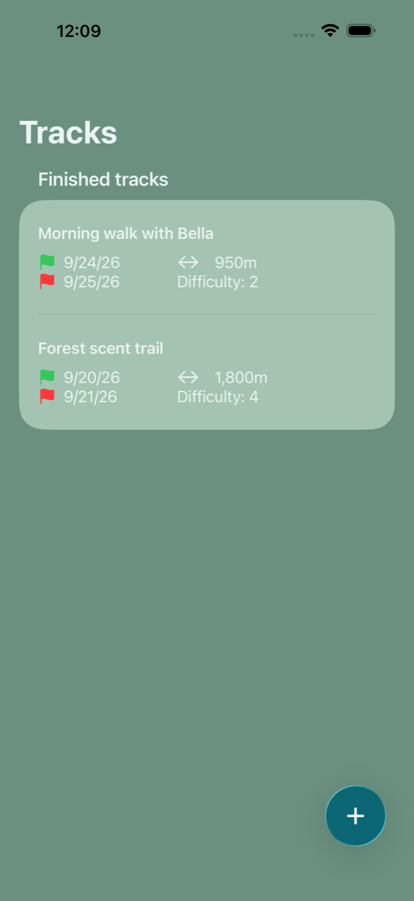
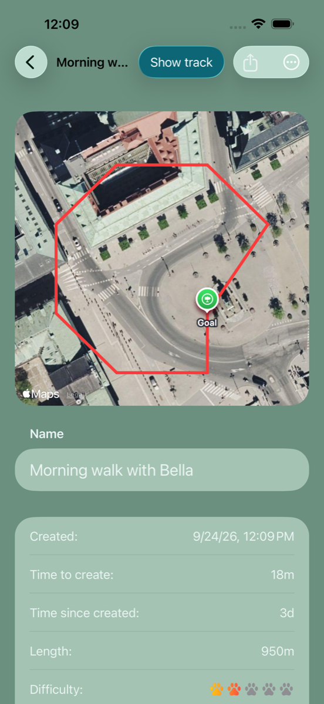
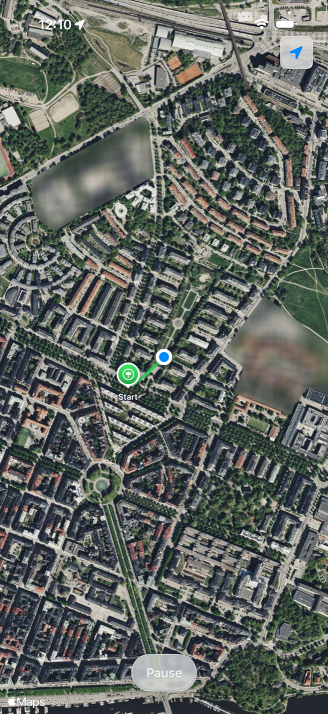

# TrackPaw

An iOS app for tracking training with dogs. Lay a track with your phone's GPS, let it rest, then record your dog following it and compare the two routes on the map, with timing and distance for every session. Tracks sync through iCloud and can be shared with a training partner.

| Tracks | Track details | Tracking |
|---|---|---|
|  |  |  |

## Requirements

- Xcode 27 or later
- iOS 26 or later
- An Apple Developer account, to run on a device with iCloud

## Building

The project runs as-is in the Simulator. To run it on a device, which is needed for iCloud sync and sharing, use your own identifiers:

1. Open `TrackPaw.xcodeproj`. For both the **TrackPaw** and **InitializeCloudKitSchema** targets, open **Signing & Capabilities**, set **Team** to your team, and change the **Bundle Identifier** from `se.cjs.TrackPaw` to your own.
2. Under **iCloud**, replace the container `iCloud.se.cjs.TrackPaw` with one of yours. Update the identifier in `TrackPaw/Persistance/PersistenceController.swift` and `TrackPaw/TrackPaw.entitlements` to match.
3. Run the **InitializeCloudKitSchema** scheme once, signed in to iCloud. It builds the app with the `InitializeCloudKitSchema` compilation condition, which creates the CloudKit schema in your container's development environment. Then use the **TrackPaw** scheme as normal.

CloudKit sharing only works on a real device, not in the Simulator.

## Tests and linting

```bash
xcodebuild -project TrackPaw.xcodeproj -scheme TrackPaw \
  -destination 'platform=iOS Simulator,name=iPhone 17' test
```

SwiftLint runs as a build-tool plugin, with its configuration in `.swiftlint.yml`.

## Architecture

- **SwiftUI** views, organized by feature: `TrackList/`, `EditTrack/`, `Map/`, `Sharing/`.
- **`TrackMapModel`** drives recording with a [SwiftState](https://github.com/ReactKit/SwiftState) state machine: `notStarted → running ⇄ paused → done`, plus `viewing` for read-only maps.
- **`PersistenceController`**: Core Data with `NSPersistentCloudKitContainer`, using a single `Track` entity that stores the laid and followed paths as `CLLocation` arrays. It syncs through the private database and shares through CloudKit shares.
- **Localization:** English and Swedish, in `Localizable.xcstrings`.

## Releasing (fastlane)

Lanes live in `fastlane/Fastfile`:

| Lane | What it does |
|---|---|
| `fastlane beta` | Bumps the build number, archives and uploads to TestFlight |
| `fastlane screenshots` | Generates App Store screenshots in the Simulator with a simulated GPS walk |
| `fastlane release` | Uploads metadata and screenshots, and selects the latest TestFlight build. Add `submit:true` to submit for review. |

Copy `fastlane/.env.example` to `fastlane/.env` and fill in your App Store Connect API key and review contact. Change `fastlane/Appfile`, and the bundle ID in the `screenshots` lane, to your bundle ID and team.

## Contributing

Issues and pull requests are welcome at <https://github.com/callesvedin/TrackPaw/issues>.

## License

The source code is released under the [MIT License](LICENSE).

The TrackPaw name and app icon are not covered by the license. Please use your own name and icon if you publish a build of this app.
